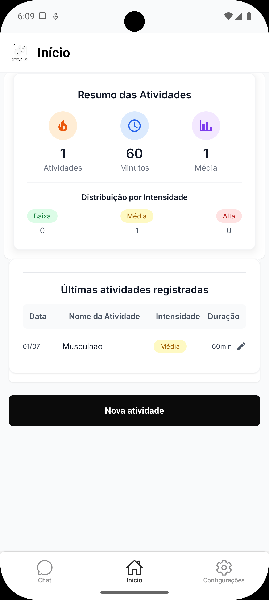
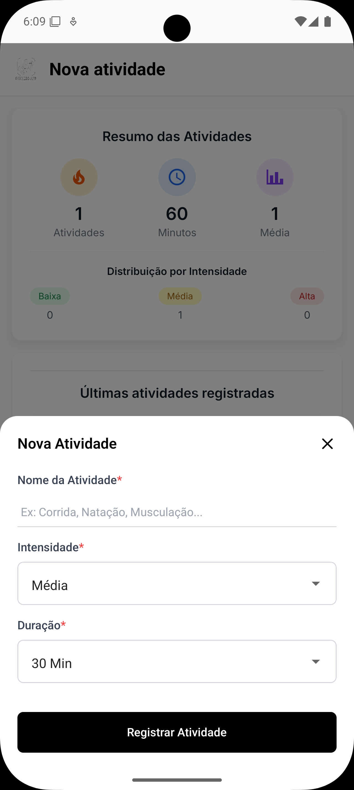
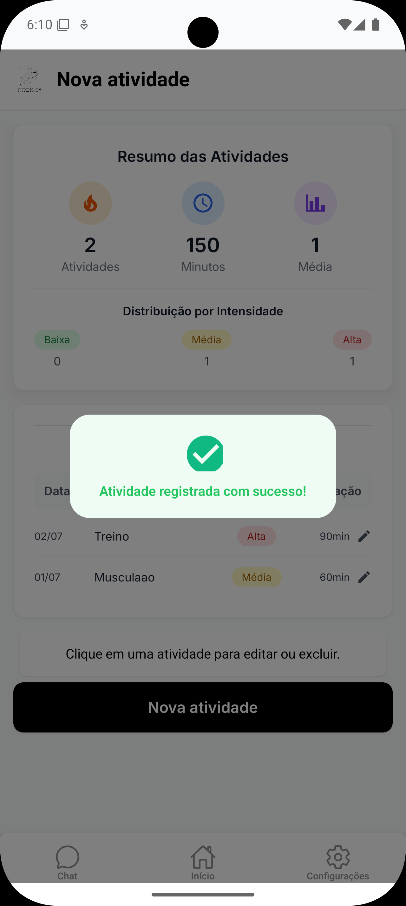
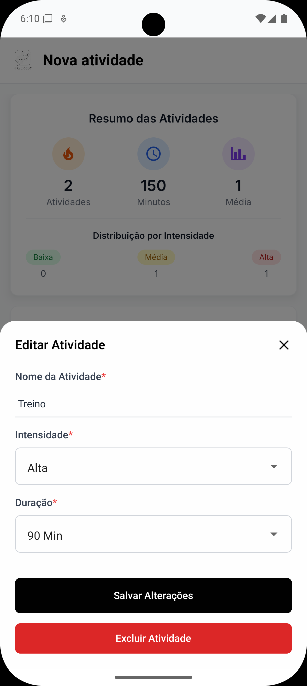
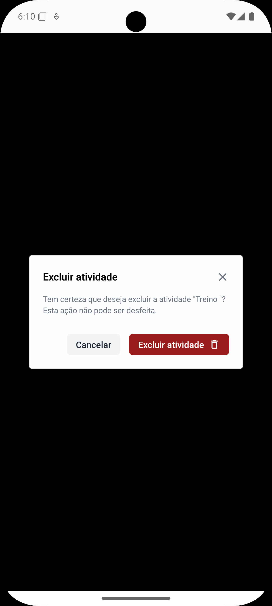

# Fitness Tracker App 🏃‍♂️

> **App de acompanhamento de atividades físicas com chatbot IA integrado**

Este é um aplicativo React Native desenvolvido com Expo, que permite aos u- Interface moderna com teclado inteligente que não cobre o input

## 🎨 Design System

- **Componentes reutilizáveis**: Button, Input, AppHeader com variantes padronizadas
- **Paleta consistente**: #0A0A0A como cor primária, espaçamento em múltiplos de 4px  
- **Tipografia**: Fonte Inter para legibilidade mobile
- **Feedback visual**: Loading states, error handling e confirmações para todas as açõesastrar e acompanhar suas atividades físicas, além de interagir com um chatbot para dicas de exercícios.

## � Funcionalidades

### ✅ **Autenticação**
- Login e cadastro com email e senha
- Persistência de sessão com Expo SecureStore
- Logout seguro

### 🏠 **Dashboard**
- Resumo estatístico das atividades (total de atividades, minutos, distribuição por intensidade)
- Lista das atividades recentes
- Widgets visuais com dados em tempo real

### 📝 **Gestão de Atividades**
- Cadastro de atividades físicas (nome, duração, intensidade)
- Edição e exclusão de atividades
- Validação de formulários

### 👤 **Perfil do Usuário**
- Visualização de dados do usuário (email)
- Configurações de conta
- Opções de logout

### 🤖 **Chatbot IA**
- Chat interativo para dicas de exercícios
- Integração com API de chatbot
- Interface de chat em tempo real

## 🚀 Como Executar

### Pré-requisitos
- Node.js (versão 18 ou superior)
- npm ou yarn
- Expo CLI
- Expo Go (para teste em dispositivo físico)

### Instalação

1. **Clone o repositório**
   ```bash
   git clone <url-do-repositorio>
   cd mobile-app
   ```

2. **Instale as dependências**
   ```bash
   npm install
   ```

3. **Configure as variáveis de ambiente**
   ```bash
   # Crie um arquivo .env na raiz do projeto
   API_BASE_URL=https://sua-api.com/api
   ```

4. **Inicie o servidor de desenvolvimento**
   ```bash
   npx expo start
   ```

5. **Execute o app**
   - **Expo Go**: Escaneie o QR code no seu dispositivo
   - **Emulador Android**: Pressione `a`
   - **Simulador iOS**: Pressione `i`
   - **Web**: Pressione `w`

### 📱 Executando em Dispositivo Físico

#### **Opção 1: Expo Go (Rede Local)**
```bash
npx expo start
```
- Certifique-se de que o dispositivo e o computador estão na mesma rede Wi-Fi
- Escaneie o QR code com o app Expo Go

#### **Opção 2: Expo Tunnel (Para Redes Diferentes)**
Ideal quando o dispositivo não está na mesma rede ou para compartilhar com outros:

```bash
npx expo start --tunnel
```

**Vantagens do Tunnel:**
- ✅ Funciona em qualquer rede
- ✅ Permite teste por outras pessoas remotamente
- ✅ Bypassa restrições de firewall corporativo
- ✅ Compartilhamento fácil via QR code público

**Como usar:**
1. Execute `npx expo start --tunnel`
2. Aguarde o tunnel ser estabelecido (pode levar alguns segundos)
3. Escaneie o QR code gerado
4. O app será carregado via tunnel seguro do Expo

#### **Opção 3: Backend Externo (Ngrok)**
Para conectar com uma API externa durante desenvolvimento:

```bash
# Terminal 1: Rode seu backend
npm run dev  # ou yarn dev

# Terminal 2: Exponha o backend via ngrok
npx ngrok http 3000

# Terminal 3: Configure a URL no app e inicie
export API_BASE_URL=https://abc123.ngrok.io/api
npx expo start --tunnel
```

### 🔧 Configuração de Ambiente

#### **Variáveis de Ambiente**
Crie um arquivo `.env` na raiz do projeto:

```env
# API Configuration
API_BASE_URL=http://localhost:3000/api

# Para desenvolvimento com ngrok
# API_BASE_URL=https://your-ngrok-url.ngrok.io/api

# Para produção
# API_BASE_URL=https://your-production-api.com/api
```

## 📸 Screenshots do Projeto

<div align="center">

### 🔐 **Autenticação**



*Telas de login e cadastro com validação de formulários*

### 🏠 **Dashboard Principal**


*Dashboard com resumo estatístico e atividades recentes*

### 📝 **Gestão de Atividades**



*Cadastro e listagem de atividades físicas*

### 👤 **Perfil e Configurações**


*Tela de configurações do usuário*

### 🤖 **Chatbot IA**


*Interface de chat com IA para dicas de exercícios*

</div>

## ✨ Funcionalidades

### 🔐 **Autenticação Completa**
- Login/cadastro com validação e persistência segura (SecureStore)
- Logout automático em caso de token inválido

### 📊 **Dashboard Inteligente**
- Resumo estatístico com total de atividades e distribuição por intensidade
- Lista de atividades recentes com atualização em tempo real

### 🏃‍♂️ **Gestão de Atividades**
- CRUD completo: cadastro, edição e exclusão com confirmação
- Validação de formulários com feedback visual

### 🤖 **Chatbot IA**
- Chat em tempo real com histórico persistente
- Interface moderna com teclado inteligente que não cobre o input

## 🎨 Design System

## � Design System e UX

### **Componentes Reutilizáveis**
- **Button**: Botão padronizado com variantes (primary, secondary, danger)
- **Input**: Campo de entrada com validação e estados visuais
- **AppHeader**: Cabeçalho consistente com suporte a ações customizadas
- **ActionButton**: Botões de ação com ícones e estados
- **LoadingCard**: Placeholders durante carregamento

### **Padrões Visuais**
- **Cores consistentes**: Paleta padronizada com #0A0A0A como primary
- **Espaçamento uniforme**: Sistema de spacing baseado em múltiplos de 4px
- **Tipografia**: Fonte Inter para legibilidade em dispositivos móveis
- **Ícones**: Expo Vector Icons para consistência visual
- **Bordas arredondadas**: Padrão de 8px para elementos interativos

### **Estados e Feedback**
- **Loading states**: Shimmer effects e spinners contextuais
- **Error handling**: Mensagens claras com opções de retry
- **Success feedback**: Confirmações visuais para ações concluídas
- **Empty states**: Ilustrações e textos para estados vazios

### **Responsividade**
- **Layout flexível**: Adapta-se a diferentes tamanhos de tela
- **Touch targets**: Mínimo de 44px para acessibilidade
- **Keyboard handling**: KeyboardAwareScrollView para melhor UX
- **Safe areas**: Respeita notch e áreas seguras dos dispositivos

## �🏗️ Arquitetura

### **Estrutura de Pastas**
```
app/
├── (auth)/           # Telas de autenticação
├── (tabs)/           # Telas principais (tabs)
└── _layout.tsx       # Layout raiz

components/
├── forms/            # Componentes de formulário
├── ui/               # Componentes de interface
└── *.tsx             # Componentes reutilizáveis

hooks/
├── useAuth.ts        # Hook de autenticação
├── useActivities*.ts # Hooks de atividades
└── useChatbot.ts     # Hook do chatbot

services/
├── api.ts            # Configuração base da API
├── authService.ts    # Serviços de autenticação
├── activitiesService.ts # Serviços de atividades
└── chatbotService.ts # Serviços do chatbot

types/
└── index.ts          # Tipagens TypeScript
```

### **Arquitetura de Componentes**

#### **Princípios Utilizados**
- **Separation of Concerns**: Cada arquivo tem uma responsabilidade específica
- **Composition over Inheritance**: Composição de componentes menores
- **Single Responsibility**: Um componente, uma responsabilidade
- **DRY (Don't Repeat Yourself)**: Reutilização máxima de código
- **Type Safety**: Tipagem forte em todos os componentes

#### **Padrões Implementados**
- **Custom Hooks**: Lógica reutilizável (useAuth, useActivities)
- **Service Layer**: Centralização de chamadas API
- **Container/Presenter**: Separação de lógica e apresentação
- **Error Boundaries**: Tratamento centralizado de erros
- **Loading States**: Estados de carregamento consistentes

### **Stack Tecnológica**
- **Framework**: React Native + Expo
- **Navegação**: Expo Router (file-based routing)
- **Estado**: React Query + Zustand
- **Persistência**: Expo SecureStore
- **HTTP Client**: Axios
- **Estilização**: TailwindCSS (NativeWind)
- **Ícones**: Expo Vector Icons
- **Tipagem**: TypeScript

## 🧠 Decisões Técnicas

### **Por que React Native + Expo?**
- **Produtividade**: Desenvolvimento rápido para iOS e Android simultaneamente
- **Ecosystem**: Ampla biblioteca de componentes e ferramentas prontas
- **Hot Reload**: Desenvolvimento ágil com feedback instantâneo
- **Expo Go**: Teste fácil em dispositivos físicos sem build nativo
- **EAS Build**: Deploy simplificado para stores

### **Por que Expo Router?**
- **File-based routing**: Estrutura intuitiva baseada em arquivos
- **Type Safety**: Navegação tipada automaticamente
- **Nested Layouts**: Layouts aninhados para melhor organização
- **Tab Navigation**: Implementação nativa de tabs sem configuração complexa
- **Deep Linking**: Suporte nativo para links profundos

### **Por que React Query + Zustand?**
- **React Query (TanStack Query)**:
  - Cache automático e sincronização de dados
  - Estados de loading/error gerenciados automaticamente
  - Invalidação inteligente de cache
  - Retry automático em caso de falhas
  - Melhor performance com menos re-renders

- **Zustand**:
  - Store global leve e simples
  - Boilerplate mínimo comparado ao Redux
  - TypeScript nativo
  - Ideal para estado de autenticação

### **Por que Expo SecureStore?**
- **Segurança**: Armazenamento criptografado para tokens sensíveis
- **Persistência**: Dados mantidos entre sessões
- **Cross-platform**: Funciona identicamente em iOS e Android
- **API simples**: Implementação direta sem complexidade

### **Por que Axios?**
- **Interceptors**: Middleware para adicionar tokens automaticamente
- **Error Handling**: Tratamento centralizado de erros
- **Request/Response Transform**: Manipulação de dados centralizada
- **Timeout**: Controle de tempo limite das requisições
- **TypeScript**: Tipagem robusta para requests

### **Por que TailwindCSS (NativeWind)?**
- **Produtividade**: Estilização rápida com classes utilitárias
- **Consistência**: Design system padronizado
- **Responsividade**: Classes responsivas prontas
- **Manutenibilidade**: Estilos colocalizados com componentes
- **Performance**: CSS otimizado automaticamente

### **Por que TypeScript?**
- **Type Safety**: Detecção de erros em tempo de compilação
- **IntelliSense**: Autocompletar e documentação inline
- **Refactoring**: Mudanças seguras em código large-scale
- **Manutenibilidade**: Código autodocumentado
- **Team Development**: Contratos claros entre desenvolvedores

## 🔍 Estratégia de Debug

### **Console.logs Estratégicos**
O projeto implementa logs detalhados para facilitar a depuração:

#### **Autenticação**
```typescript
// authService.ts
console.log('🔐 Login attempt:', { email });
console.log('✅ Login successful:', { userId, token: token.substring(0, 20) + '...' });
console.log('❌ Login failed:', error.message);
```

#### **Atividades**
```typescript
// activitiesService.ts
console.log('📝 Creating activity:', activity);
console.log('✅ Activity created:', result);
console.log('🔄 Updating activity:', { id, data });
console.log('🗑️ Deleting activity:', id);
```

#### **Chatbot**
```typescript
// chatbotService.ts
console.log('🤖 Sending message:', message);
console.log('💬 Bot response:', reply);
```

#### **API Interceptors**
```typescript
// api.ts
console.log('📡 Request:', { method, url, token: token ? 'Present' : 'Missing' });
console.log('📥 Response:', { status, data });
console.log('🚨 API Error:', { status, message, endpoint });
```

### **Benefícios da Estratégia de Debug**
- **Rastreamento completo**: Cada operação é logada
- **Identificação rápida**: Logs com emojis para fácil identificação
- **Dados sensíveis**: Tokens são mascarados por segurança
- **Fluxo de dados**: Visualização clara do ciclo request/response
- **Troubleshooting**: Facilita identificação de problemas em produção

### **Exemplo de Log Completo**
```
🔐 Login attempt: { email: "user@example.com" }
📡 Request: { method: "POST", url: "/auth/login", token: "Missing" }
📥 Response: { status: 200, data: { token: "eyJ...", user: {...} } }
✅ Login successful: { userId: "123", token: "eyJhbGciOiJIUzI1NiIsInR5cCI6IkpXVCJ9..." }
📝 Creating activity: { name: "Corrida", duration: 30, intensity: "high" }
📡 Request: { method: "POST", url: "/activities", token: "Present" }
📥 Response: { status: 201, data: { id: "456", name: "Corrida" } }
✅ Activity created: { id: "456", name: "Corrida", duration: 30 }
```

## ⚡ Performance e Otimizações

### **React Query Optimizations**
- **Stale Time**: Cache inteligente para reduzir requests desnecessários
- **Background Refetch**: Atualização silenciosa de dados
- **Optimistic Updates**: UI responsiva com updates otimistas
- **Query Invalidation**: Sincronização automática após mutations

### **Component Optimizations**
- **React.memo**: Prevenção de re-renders desnecessários
- **useMemo/useCallback**: Otimização de cálculos e funções
- **Lazy Loading**: Carregamento sob demanda de componentes
- **FlatList**: Listas virtualizadas para performance

### **Bundle Optimization**
- **Tree Shaking**: Eliminação de código não utilizado
- **Code Splitting**: Divisão inteligente do bundle
- **Asset Optimization**: Compressão de imagens e ícones

### **Memory Management**
- **Cleanup Functions**: Limpeza de listeners e timers
- **AbortController**: Cancelamento de requests em componentes desmontados
- **Cache Limits**: Limites inteligentes de cache do React Query

## 🔗 Integração com API

### **Endpoints Utilizados**
```
POST /auth/login          # Login do usuário
POST /auth/register       # Cadastro do usuário
GET  /users/me           # Dados do usuário logado
GET  /activities         # Lista de atividades
POST /activities         # Criar atividade
PATCH /activities/:id    # Atualizar atividade
DELETE /activities/:id   # Deletar atividade
GET  /activities/summary # Resumo estatístico
POST /chatbot           # Chat com IA
```

### **Autenticação**
- Token JWT armazenado no SecureStore
- Interceptor automático para adicionar Authorization header
- Redirecionamento automático em caso de token inválido

## 📋 Funcionalidades Técnicas

### **Gerenciamento de Estado**
- **React Query**: Cache, sincronização e estado de loading/error
- **Zustand**: Estado global de autenticação
- **Expo SecureStore**: Persistência segura de tokens

### **Tratamento de Erros**
- Estados de erro em todos os componentes
- Botões de "tentar novamente"
- Fallbacks visuais para dados indisponíveis

### **UX/UI**
- Loading states consistentes
- Feedback visual para ações do usuário
- Interface responsiva e acessível
- Componentes reutilizáveis

## 🧪 Build e Deploy

### **Desenvolvimento**
```bash
npx expo start --dev-client
```

### **Build para Produção**
```bash
# Android
eas build --platform android

# iOS
eas build --platform ios

# Ambos
eas build --platform all
```

### **Deploy OTA**
```bash
eas update --auto
```

## 📱 Compatibilidade

- **Expo Go**: ✅ Totalmente compatível
- **Development Build**: ✅ Suportado
- **EAS Build**: ✅ Configurado
- **Plataformas**: iOS, Android

## 🔧 Scripts Disponíveis

```bash
npm start          # Inicia o servidor Expo
npm run android    # Executa no emulador Android
npm run ios        # Executa no simulador iOS
npm run web        # Executa no navegador
npm run reset-project # Reseta o projeto
```

## � Troubleshooting

### **Problemas Comuns**

#### **1. Erro de Conexão com API**
```bash
# Verifique se o backend está rodando
curl http://localhost:3000/api/health

# Para desenvolvimento remoto, use ngrok
npx ngrok http 3000
# Copie a URL HTTPS gerada e configure no .env
```

#### **2. QR Code não Carrega**
```bash
# Use tunnel se estiver em rede diferente
npx expo start --tunnel

# Ou tente limpar cache
npx expo start --clear
```

#### **3. Problemas de Cache**
```bash
# Limpe completamente o cache
npx expo start --clear
rm -rf node_modules
npm install
```

#### **4. Metro Bundler Issues**
```bash
# Reset do Metro
npx expo start --reset-cache

# Ou restart completo
npx expo start --dev-client --clear
```

### **Testando em Dispositivo Físico**

#### **Para Desenvolvimento Local:**
1. **Mesma rede Wi-Fi**: Use `npx expo start`
2. **Redes diferentes**: Use `npx expo start --tunnel`
3. **Problemas de firewall**: Use sempre `--tunnel`

#### **Para API Externa:**
1. Configure a URL da API no `.env`
2. Use HTTPS para produção
3. Para desenvolvimento, use ngrok para exposição segura

### **Logs de Debug**
O app possui logs detalhados no console. Para visualizar:

```bash
# Inicie com logs verbosos
npx expo start --dev-client

# Ou use o DevTools
# Pressione 'm' no terminal do Expo para abrir
```

### **Configuração para Produção**
```bash
# Configure a URL da API para produção
echo "API_BASE_URL=https://sua-api-producao.com/api" > .env

# Build otimizado
eas build --platform all --profile production
```

## �📊 Critérios de Qualidade Atendidos

- ✅ **Cobertura completa dos requisitos**
- ✅ **Código organizado e componentizado**
- ✅ **Persistência de sessão robusta**
- ✅ **Integração funcional com chatbot**
- ✅ **Tratamento adequado de erros**
- ✅ **Interface polida e responsiva**
- ✅ **Arquitetura escalável**

## 🤝 Como Contribuir

1. Fork o projeto
2. Crie uma branch para sua feature (`git checkout -b feature/AmazingFeature`)
3. Commit suas mudanças (`git commit -m 'feat: add some AmazingFeature'`)
4. Push para a branch (`git push origin feature/AmazingFeature`)
5. Abra um Pull Request

### **Padrões de Desenvolvimento**
- **Commits semânticos**: Use conventional commits (feat, fix, docs, etc.)
- **TypeScript**: Todos os componentes devem ser tipados
- **ESLint**: Siga as regras de linting configuradas
- **Prettier**: Use formatação automática
- **Componentes**: Mantenha componentes pequenos e focados
- **Hooks**: Extraia lógica complexa para custom hooks

### **Estrutura de Pull Request**
```markdown
## � Descrição
Breve descrição das mudanças

## 🔧 Tipo de Mudança
- [ ] Bug fix
- [ ] Nova feature
- [ ] Breaking change
- [ ] Documentação

## ✅ Checklist
- [ ] Código segue padrões do projeto
- [ ] Componentes estão tipados
- [ ] Testes passando (se aplicável)
- [ ] Documentação atualizada
```

## 📚 Recursos Adicionais

### **Documentação Técnica**
- [Expo Documentation](https://docs.expo.dev/)
- [React Navigation](https://reactnavigation.org/)
- [React Query](https://tanstack.com/query/latest)
- [NativeWind](https://www.nativewind.dev/)

### **Links Úteis**
- [Expo Go App](https://expo.dev/client)
- [EAS Build](https://docs.expo.dev/build/introduction/)
- [Expo Tunnel](https://docs.expo.dev/more/expo-cli/#expo-start)

## �📄 Licença

Este projeto está sob a licença MIT. Veja o arquivo [LICENSE](LICENSE) para mais detalhes.

---

<div align="center">

**🏃‍♂️ Fitness Tracker App**

*Desenvolvido com ❤️ para o teste técnico Fullstack Mobile*

**Stack:** React Native • Expo • TypeScript • React Query • TailwindCSS

[](https://expo.dev)
[](https://reactnative.dev)
[](https://typescriptlang.org)

</div>
